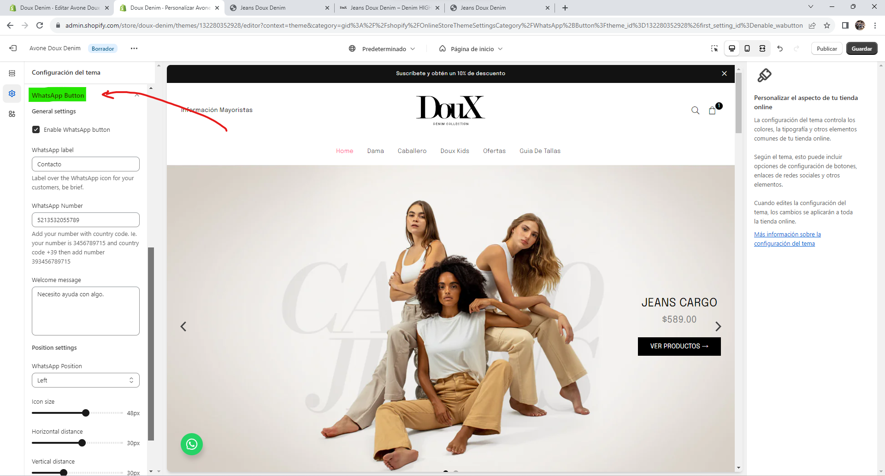

# WhatsApp Button for Shopify
Shopify WhatsApp button for integration with almost any theme. Does not requires any library to work.
Easy to integrate, great customization.

## Installation
1.- Just copy the next files into your theme assets folder
> **whatsapp-button.css.liquid**


> **ic_whatsapp.svg**

---

2.- Then add the next file into **fragments** folder
> **whatsapp-button.liquid**

---

4.- The next step is to add the content of
> **whatsapp-settings-theme-schema.json**


Into your theme settings: **Config-> settings_schema.json**, you can choose where you want to add this section. It's meant to be part of theme settings, not product/page/section.

It will look like something like this:
```
{
    "name": "Layout Style",
    "settings": [
      {
        "type": "select",
        "id": "layout_style",
        "label": "Select Layout",
        "default": "normal",
        "options": [
          {
            "label": "Default",
            "value": "normal"
          },
          {
            "label": "Full Width Layout",
            "value": "fullwidth"
          },
          {
            "label": "Boxed Layout",
            "value": "boxedlayout"
          }
        ]
      } //Add a comma here and paste the json content after the comma
    ]
}
```
**Note:** Do not add comments to JSON by any means, this will break your JSON. Its just an example where to put the code.

## Configure your button


Within the "Customize theme" section in Shopify you can adjust the information of the button.

## Support

